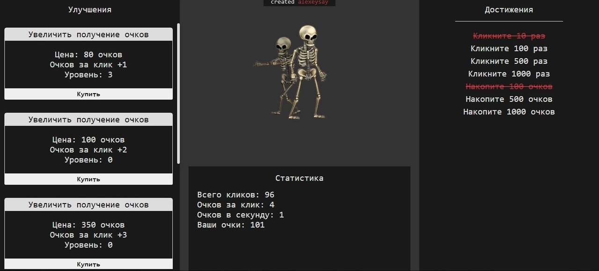

<h1 align="center"> Vue Clicker </h1>

### О проекте:
Из React, Angular и Vue я выбрал Vue, потому что мне показалось, что его будет легче изучить, поэтому этот кликер создан на Vue как практика этого фреймворка. Эта игра полностью создана мной, я не использовал обучающих видео или статей для написания кода игры, единственное, что я брал из интернета для кода, это способ использования Vue, я читал документацию с официального сайта.

В этой игре есть: улучшение характеристик игрока, звуки, уведомления (надписи над stats), выполняемые достижения(у них будет меняться класс), статистика.

[Ссылка на сайт](https://alexeysay.github.io/Vue-Clicker.github.io/)
### CSS и HTML
В этой игре я решил использовать grid и flex в свзяке, что бы было легче позиционировать блоки информации. В HTML я решил создать page, у которого будет grid, у него есть 4 области - shop, btn, stats и achievements, этим областям был присвоен flex для позиционирования внутренних элементов, я использую их как контейнер, а не как блок с информацией.

### Vue и механика игры
Я использовал CDN для подключения Vue 2 версии. У элемента, у которого есть класс page, так же есть id app, с помощью этого id я связываю этот элемент с Vue.

##### Переменные
- Переменная counter, она просто считает клики. 
- Переменная score нужна для покупки улучшений в магазине, score увеличивется на переменную scoreUp за каждый клик по кнопке(скелетам).
- Переменная scoreup изначально равна 1, что бы score увеличивался при клике. scoreup изменяется через магазин.
- Переменная passiveScore изначально равна 0, нужна для начисления score в пассивном режиме(не кликая). 
- Массив achievements, в нём хранятся объекты, в объекте есть 1. условие для выполнения, 2. название, 3. выполнено ли достижение. 
- Массив upgrade, хранит в себе объекты, в объекте находится 1. айди, 2. цена, 3. названия, 4. описание, 5. на сколько оно улучшает, 6. уровень. 
- Массив skeleton, в нём хранятся пути до звуков скелета.

##### Методы
- mainBtn, срабатывает при клике по кнопке(скелетам), изменят перменные counter и score, запускает рандомный звук скелету из массива skeleton
- shopBtnClick, срабатывает при клике по кнопке в магазине, в метод передаётся item (v-for="item in upgrade"). Если у игрока достаточно score, характеристики игрока улучшатся, сыграет музыка улучшения(подключенная в html), если score недостаточно, то игрок ничего не получит, появится звук ошибки и уведомляющая надпись над блоком статистики

##### Вычисляемое (computed)
- achievementsUpdate, пробегаюсь по массиву achievements, для каждого объекта применяю условие, если условие выполняется, то сыграет звук выполнения достижения, item.done = true, из за этого у элемента в html добавится класс и достижение зачеркнётся, так же появится уведомляющая надпись о выполнении достижения
- scoreUpdate, каждые 4 секунды увеличивает score на passiveScore. Изначально passiveScore = 0, поэтому score не увеличивается, но в магазине можно купить улучшение, тогда score будет увеличиваться каждые 4 секунды на passiveScore.

### Установка:
> git clone https://github.com/AlexeySay/Vue-Clicker.github.io.git

##### Ссылки на другие репозитории, которые я хотел бы показать
(все репозитории на GitHub Pages)

[Concept_adidas](https://github.com/AlexeySay/Concept_adidas) - моя вёрстка современного дизайна по макету, без vue, использовал js библеотеку slick(для слайдера)

[js_task.github.io](https://github.com/AlexeySay/js_task.github.io) - здесь я выполнял задания по JS, которые находил в интернете

[vue_shop](https://github.com/AlexeySay/vue_shop) - здесь я создавал магазин по обучающему видео, использовал Vue CLI, Vuex, Vue-router, Axios
